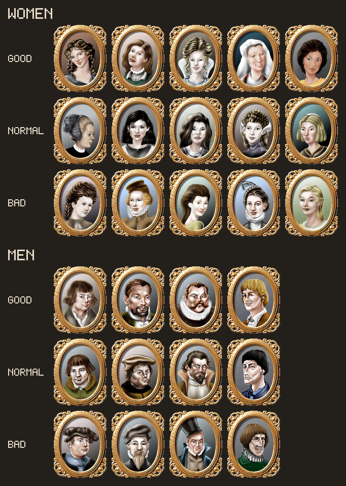

# Marriage

Marrying does two things: it adds a fixed bonus to the merchant's
[reputation](./reputation.md) in his own hometown, and it is the precondition for children.
Which spouse you are offered is a single `rand()`, and nothing about the merchant influences it.

## The Three Tiers

There are thirty candidates, fifteen of each gender, in three tiers of five. The game keeps the
portraits in `images/Gesichter/`, one folder per gender and tier, and **the folder name is the
tier**:

|Folder|Tier|Reputation bonus|
|-|-|-|
|`nett`|2|**+2**|
|`normal`|1|**+1**|
|`ernst`|0|**+0**|

The bonus is the tier number itself, so the whole spread between the best and worst match is two
points, and an `ernst` spouse is not a penalty - it simply contributes nothing. The portrait is
decided by the same roll, so the face tells you the tier before you accept.



Which face within a tier you get changes nothing.

## How the Candidate Is Chosen

|Step|Where|What|
|-|-|-|
|1|the matchmaker's letter arrives|"are you interested in marriage? For the small sum of %i"|
|2|accepting it enqueues **operation `0x72`**, from the single site `0x004D6D5C`|pays the fee and rolls the candidate|
|3|handler `0x0053EAC0`|deducts the fee, schedules **scheduled task `0x17`**|
|4|handler `0x004E8684`|builds the candidate letter from the roll|
|5|accepting that enqueues **operation `0x60`**|rolls the dowry, schedules the wedding, **task `0x15`** (`0x004E7C74`)|

**The roll happens at step 2, when the fee is paid.** `0x004D6DBF` writes three random words into
`op+0x8`, `+0xA` and `+0xC`, and the spouse's hometown as `rand() % town_count` into `op+0xE`.
Operation `0x72`'s case passes `op+4` to its handler (`lea eax,[esi+0x4]` at `0x00536B43`), which
copies sixteen bytes from there into the task payload, so the offer builder reads the **first of
those three words**:

```c
tier   = rand_word % 3;                 // 0x004E86E5..0x004E86F6
within = (rand_word / 3) % 5;           // 0x004E86F1..0x004E86F9  - which of the five
letter[0x0A] = tier;                    // 0x004E86FB - this is the reputation bonus
```

`rand()` is the CRT generator at `0x00639C03`, returning `0`..`32767`, so each tier comes up
**33.33%** of the time. Rank, reputation, hometown, money and the matchmaker's town play no part
in it.

The face is `portrait_table[tier * 5 + within]`, from one of two fifteen-byte tables chosen by
gender - `0x006726BC` for the women and `0x006726CB` for the men (`0x004E8750` / `0x004E8776`).
The result indexes the portrait graphics directly: the personal page does
`graphic_id = merchant + 0x27 + 0x88B8` (`0x005DB93D`), and `0x88B8` is 35000, which
`scripts/Gesichter.ini` declares as `Frau0ID`..`Frau14ID` = 35000..35014 and
`Mann0ID`..`Mann14ID` = 35015..35029.

Two data quirks in the men's half, which line up: `Mann_5.bmp` is a byte-for-byte copy of
`Mann_1.bmp` in all three male folders, so only **twelve** distinct male faces exist rather than
fifteen - and the men's table offers exactly four distinct ids per tier, twelve in all, never
producing ids 19, 24 or 29. The women's fifteen are all distinct.

### The two things that are not random

- **The fee**, `op+0x4`, taken from the matchmaker letter; the handler does
  `merchant.money -= fee` and `merchant + 0x4BC += fee` (`0x0053EB13`..`0x0053EB2B`).
- **The wait** for the candidate letter: `min(8, distance / 8 + 2)` days, from
  `0x00531B70(hometown, letter + 0xC)` at `0x0053EB49` - courier travel time, so a distant
  matchmaker takes longer to answer.

## The Dowry

Rolled later still, when the candidate is accepted: `(rand() & 0x1FFF) + 0x13F6` at
`0x004D6E23`, so **5,110 to 13,301**. It is independent of the tier - a bad match can still pay
well.

## What the Wedding Writes

Task `0x15` (`0x004E7C74`) copies the offer's payload onto the merchant:

|Field|Meaning|
|-|-|
|`+0x27`|the spouse's portrait, `0`..`29`; `graphic_id = 0x88B8 + this`|
|`+0x28`|a timestamp from the operation, one of the gates on childbirth|
|`+0x2C`|the **wedding date** (`0x004E7CEF`)|
|`+0x30`|the spouse's name id, resolved through `0x00512A60`|
|`+0x31`|the spouse's hometown, `0xFF` when unmarried - this doubles as the **married flag**|
|`+0x32`|the reputation bonus|
|`+0x34`|head of the merchant's chain of children|

## Spending the Bonus

`0x004F8198`, inside the reputation recompute:

```c
if (merchant[0x31] < town_count) {                    // married at all?
    hometown = merchant[0x19];                        // the merchant's OWN hometown
    merchant_rep[hometown] += (float)merchant[0x32];  // merchant + 0x2FC + hometown*4
}
```

Two things worth noting. The byte is added **raw and unscaled** to the per-town reputation float,
and it lands on the merchant's **own** hometown - the spouse's hometown only decides whether he
counts as married at all. `merchant + 0x32` has no other consumer anywhere in the executable
besides the savegame and the personal page, which picks one of four descriptions from the value
(`cmp eax,3` and a jump table at `0x005DBCBC`, `0x005DBBF3`).

The AI merchants' own marriage path (`0x004E8234`, scheduled task `0x16`) rolls its bonus as `rand() & 3`
(`0x004E8438`) with no reference to a tier, so an AI spouse can be worth **3** - a value the
player's path cannot produce, which is why the personal page has a fourth description.

## Children

Being married is the precondition for **operation `0x87`** (`0x0053FEA0`), which is a birth - see
the letters at `0x006AEC18` ("our darling daughter %s was born") and `0x006AECE0` ("a baby boy
was born to us today"). Its gates:

|Gate|Where|
|-|-|
|`merchant + 0x31 < town_count` - married|`0x0053FF04`|
|`now > merchant + 0x28`|`0x0053FF1F`|
|`now >= merchant + 0x2C + 0x11700` - **279 days** since the wedding, at 256 ticks a day|`0x0053FF2A`|
|no existing child younger than 279 days - the chain is walked comparing `now - 0x11700` against each record's birth stamp at `+0x4`|`0x0053FF49`..`0x0053FF63`|

On success it calls `0x005097C0`, the **[auto-trader](../auto-traders.md) allocator**, so a child
is the same kind of record as a captain or an administrator, and links it into the merchant's own
chain at `merchant + 0x34` (`0x0053FF77`, `0x0053FF88`).

The tier has no bearing on any of this: marrying at all is what opens the mechanic.
